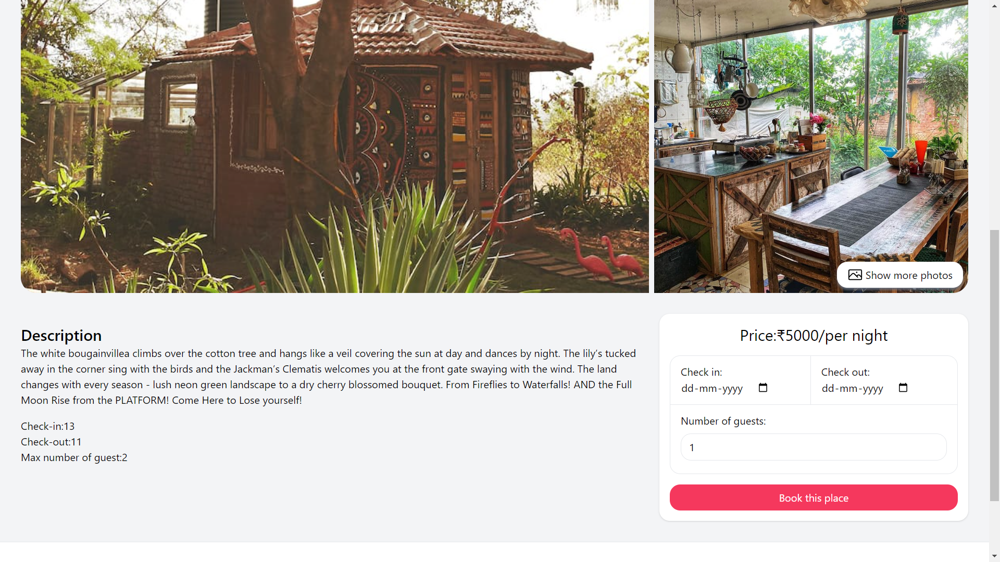

# AirBnB Clone

Airbnb clone project, offering a user-friendly platform for property rentals with robust features such as property listing, booking.


## Features

- Login / Register Page
- Creating / Updating Sccommodations
- Booking Accommodation
- Hotel Google Map Location


## Tech Stack

**Client:** React, TailwindCSS

**Server:** Node, Express, MongoDB


## Run Locally

Clone the project

```bash
  git clone https://github.com/sakethrambilla/airbnb-clone.git
```

Go to the project directory

```bash
  cd airbnb-clone
```

### Install dependencies

1 Frontend
```bash
  cd client
  npm install
```
2 Backend
```bash
  cd api
  npm install
```

3 Start the app

```bash
  cd client
  npm run dev
```

4 Start the server

```bash
  cd api
  nodemon index.js
```


## Environment Variables

To run this project, you will need to add the following environment variables to your .env file

`
MONGO_URL =mongodb+srv://<username>:<password>@cluster0.rtssrsm.mongodb.net/?retryWrites=true&w=majority
`

## Screenshots





## API Reference

#### Get all items

```
  GET /api/items
```

| Parameter | Type     | Description                |
| :-------- | :------- | :------------------------- |
| `api_key` | `string` | **Required**. Your API key |

#### Get item

```
  GET /api/items/${id}
```

| Parameter | Type     | Description                       |
| :-------- | :------- | :-------------------------------- |
| `id`      | `string` | **Required**. Id of item to fetch |

#### add(num1, num2)

Takes two numbers and returns the sum.


